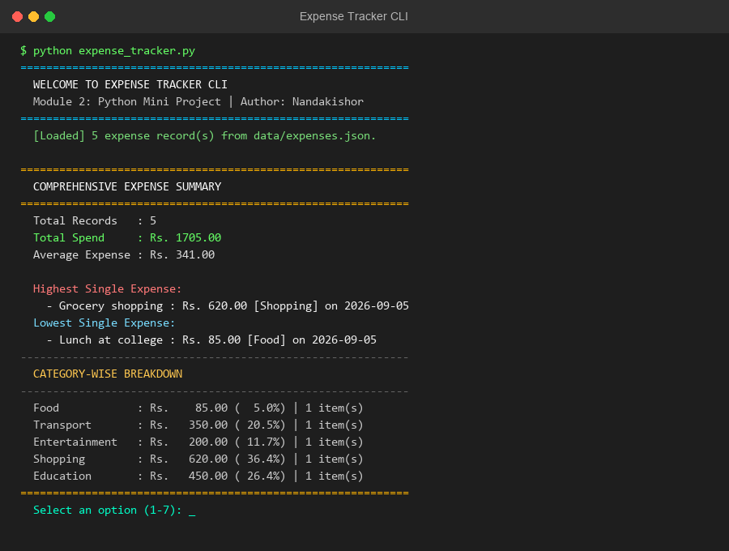

# Module 2: Python Mini Project — Expense Tracker

Welcome to **Module 2: Python Mini Project**.

This project implements a complete, terminal-based **Expense Tracker Application** in Python. It builds directly upon the concepts learned in Module 1 (Variables, Data Types, Control Structures, Loops, Lists, Dictionaries, Functions, and File I/O) to deliver a practical real-world CLI tool.

---

## Table of Contents
- [Project Overview](#project-overview)
- [Directory Structure](#directory-structure)
- [Key Features](#key-features)
- [Concepts Applied](#concepts-applied)
- [Prerequisites & Installation](#prerequisites--installation)
- [How to Run](#how-to-run)
- [Sample Usage & Demo](#sample-usage--demo)
- [Data Storage Schema](#data-storage-schema)
- [Future Enhancements](#future-enhancements)
- [Author](#author)

---

## Project Overview

The **Expense Tracker** is designed to help users track personal daily spending, categorize outlays, calculate cumulative spending, and gain actionable financial insights through analytical summaries and reports.

All expense data is persistently stored in JSON format, ensuring that your records remain saved across program executions.

---

## Directory Structure

```text
module-2-python-mini-project/
│
├── README.md                           # Documentation and guide
├── expense_tracker.py                  # Main CLI application
├── requirements.txt                    # Project dependencies
│
├── data/
│   └── expenses.json                   # JSON data store for expense records
│
└── screenshots/
    └── output.png                      # Application terminal output screenshot
```

---

## Key Features

1. **Add New Expenses**:
   - Captures item description, numeric amount, expense category, and transaction date.
   - Defaults automatically to the current date if none is specified.
   - Robust input validation ensures negative amounts and empty descriptions are rejected.

2. **View All Expenses**:
   - Tabulates records in clean, formatted cards.
   - Shows total record count and grand total expenditure.

3. **Category Filtering**:
   - Displays real-time expense totals grouped by standard categories (`Food`, `Transport`, `Entertainment`, `Shopping`, `Health`, `Education`, `Other`).
   - Drills down to list individual items belonging to any chosen category.

4. **Keyword Search**:
   - Case-insensitive search across descriptions and categories.
   - Computes matching sum on the fly.

5. **Analytical Summary Report**:
   - Computes total spend, average transaction amount, highest expense, and lowest expense.
   - Provides percentage breakdown by category.

6. **Delete Records**:
   - Safe removal of individual expense entries with immediate persistence update.

---

## Concepts Applied

```text
  Functions & Modularity   ──► Clean function separation for CRUD and analysis
  File I/O (JSON)          ──► Persistent storage using Python's json module
  Data Validation          ──► Try/Except blocks for robust error handling
  List & Dict Management   ──► Parsing, filtering, and mutating record collections
  String Formatting        ──► Structured CLI presentation using f-strings
  Datetime Handling        ──► ISO date parsing and automatic timestamps
```

---

## Prerequisites & Installation

- **Python Version**: Python 3.8 or higher.
- **Dependencies**: None (Uses Python standard library: `json`, `os`, `datetime`).

Check your Python version:
```bash
python --version
```

---

## How to Run

1. Clone or navigate to the repository:
   ```bash
   cd CODOMAX/module-2-python-mini-project
   ```

2. Run the application:
   ```bash
   python expense_tracker.py
   ```

---

## Sample Usage & Demo

### Main Menu Interface
```text
============================================================
  WELCOME TO EXPENSE TRACKER CLI
  Module 2: Python Mini Project
  Author: Nandakishor Kalagarla (AI & ML)
============================================================

  [Loaded] 5 expense record(s) from data/expenses.json.

============================================================
         EXPENSE TRACKER - MAIN MENU
============================================================
  1. Add New Expense
  2. View All Expenses
  3. Filter Expenses by Category
  4. Search Expenses by Keyword
  5. Generate Analytics & Summary Report
  6. Delete an Expense
  7. Exit
============================================================
  Select an option (1-7):
```

### Summary Report Sample Output
```text
============================================================
  COMPREHENSIVE EXPENSE SUMMARY
============================================================

  Total Records   : 5
  Total Spend     : Rs. 1705.00
  Average Expense : Rs. 341.00

  Highest Single Expense:
    - Grocery shopping : Rs. 620.00 [Shopping] on 2026-09-05

  Lowest Single Expense:
    - Lunch at college canteen : Rs. 85.00 [Food] on 2026-09-05

------------------------------------------------------------
  CATEGORY-WISE BREAKDOWN
------------------------------------------------------------
  Food            : Rs.    85.00 (  5.0%) | 1 item(s)
  Transport       : Rs.   350.00 ( 20.5%) | 1 item(s)
  Entertainment   : Rs.   200.00 ( 11.7%) | 1 item(s)
  Shopping        : Rs.   620.00 ( 36.4%) | 1 item(s)
  Education       : Rs.   450.00 ( 26.4%) | 1 item(s)
============================================================
```

---

## Data Storage Schema

Expense records are stored as an array of objects inside `data/expenses.json`:

```json
[
  {
    "id": 1,
    "description": "Lunch at college canteen",
    "amount": 85.0,
    "category": "Food",
    "date": "2026-09-05"
  }
]
```

---

## Screenshot



---

## Author

**Nandakishor Kalagarla**  
B.Tech — Computer Science & Engineering (AI & ML)  
Focused on: **Python • Machine Learning • Generative AI • AI Application Development**
